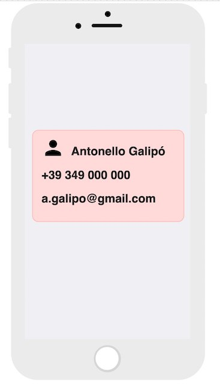

id: 0
author: Antonello Galipò and Gonçalo Palma
categories: apps, flutter
environments: web
status: draft

# BIVI - Biglietto da Visita, a Flutter Codelab

## Cosa è Flutter?
Duration 00:02

Flutter è blah blah blah

## Preparazione
Duration 00:20

Prima di iniziare sono necessarie due cose, [installare Flutter sul proprio computer](https://flutter.dev/docs/get-started/install) e [configurare un editor per utilizzarlo con Flutter](https://flutter.dev/docs/get-started/editor).

Una volta fatto ciò saremo in grado di scrivere applicazioni in Flutter e di eseguire su:
* dispositivi fisici 
* emulatore Android
* emulatore iOS

## Crea un nuovo progetto Flutter
Duration 00:05

A seconda dell'editor scelto, crea un nuovo progetto Flutter seguendo le istruzioni a [questo link](https://flutter.dev/docs/get-started/test-drive).

Chiama l'applicazione BIVI.

## Rimuovi il codice di esempio per un inizio pulito
Duration 00:02

Cancella tutto il codice contenuto in `lib/main.dart` ed incolla il seguente:

``` dart
import 'package:flutter/material.dart';

void main() => runApp(MyApp());

class MyApp extends StatelessWidget {
  @override
  Widget build(BuildContext context) {
    return MaterialApp(
      title: 'Flutter Demo',
      theme: ThemeData(
        primarySwatch: Colors.blue,
      ),
      home: MyHomePage(),
    );
  }
}

class MyHomePage extends StatelessWidget {
  @override
  Widget build(BuildContext context) {
    return Scaffold(
      appBar: AppBar(
        title: Text("BIVI!"),
      ),
      body: Center(
        child: Text("Placeholder"),
      ),
    );
  }
}
```

## Creazione della pagina principale
Duration 01:30

In questa sezione creerai la pagina contenente la prima parte del biglietto da visita.

Utilizza i widget `Card`, `Container`, `Row`, `Column` e `Text`per realizzare un layout simile a quello in figura.
Ricorda:
- gli attributi `color`, `width` ed `height` di `Container`
- la dimensione di una `Card` è dettata dal `Container ` che la contiene
- gli attributi `MainAxisAlignment` e `CrossAxisAlignmenr` di `Row` e `Column`
- l'attributo `style` di `Text`

La schermata sarà simile al seguente wireframe:


## Interattività e navigazione
Duration 01:00

### Il widget InkWell
InkWell è uno dei widget piú comuni per rendere interattivo un wigdet. 
Inserendo un widget come child di un InkWell, sarà infatti possibile specificare le azioni da compiere a fronte di un tap, doppio tap, long press, etc.

Le azioni da compiere a fronte di un evento di tocco sono descritte da funzioni di eseguire, che possono essere fornite al widget in uno dei seguenti modi:

``` dart
InkWell(
    onTap: () {
    print("tapped!");
    },
    onDoubleTap: () {
    print("double tapped!");
    },
    child: //Widget da rendere tappabile,
),
```

### La navigazione
La navigazione in Flutter puó essere vista come una pila di schermate (widget) della quale lo schermo visualizza la cima.
Ogni volta che navighiamo su una nuova schermata, la aggiungiamo alla cima della pila. Ogni volta che torniamo indietro, rimuoviamo dalla cima della pila la schermata che stiamo visualizzando in quel momento.

La navigazione è gestita da un componente specializzato chiamato Navigator.

Per navigare su una nuova schermata, un esempio di come effettuare il push di essa nello stack (pila) di navigazione in questo modo:

``` dart
Navigator.of(context)
.push(MaterialPageRoute(
    builder:(context){
        return NewPage();
    }),
);
```

Il codice riportato ottiene un riferimento all'istanza di `Navigator`
relativa al contesto attuale, e richiede il push di una nuova pagina,
costruita mediante il builder messo a disposizione dalla classe `MaterialPageRoute`.

### Rendere interattivo il biglietto da visita
È possibile combinare `InkWell` e le azioni col `Navigator` per aggiungere interattività 
e navigare su una seconda schermata, che al momento sarà vuota.

Per fare ciò:

1. Crea una nuova schermata

``` dart
class MyBiography extends StatelessWidget {
  @override
  Widget build(BuildContext context) {
    return Scaffold(
      appBar: AppBar(
        title: Text("Antonello Galipò"),
        centerTitle: true,
      ),
      body: Container(
        color: Colors.red,
      ),
    );
  }
}
```

2. Rendi tappabile il biglietto da visita inserendolo in un `InkWell` ed usando `Navigator` in questo modo:
``` dart
Navigator.of(context)
.push(MaterialPageRoute(
    builder:(context){
        return MyBiography();
    }),
);
```

## Caricamento immagini dalla rete


### Write some code
``` dart
print("Hello world");
```

## Final step
You're done for the day!
